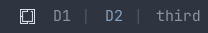
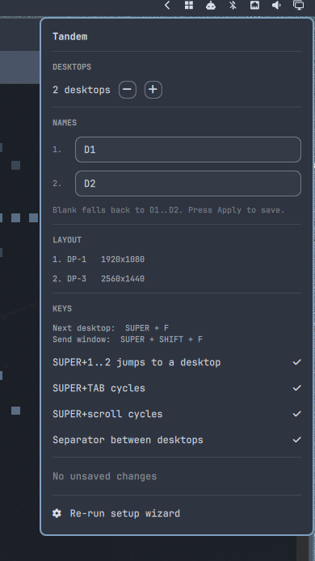

# Tandem

KDE-style virtual desktops for [Omarchy](https://omarchy.org/) / Hyprland.

Every monitor switches workspace **together**, instead of Omarchy's default of
independent per-monitor workspaces. The bar shows `D1 D2` instead of
workspaces `1-5`.

Built with Claude Code.

## Why

I like the way KDE handled this with virtual desktops as opposed to independent workspaces. I typically only have 2 "workspaces" that I swap back and forth between with SUPER + F and I wanted this ability in Omarchy.

https://github.com/thevideinfra/tandem/raw/main/assets/demo.mp4



## Model

A desktop owns one workspace per monitor:

```
workspace = (desktop - 1) * #MONITORS + monitor_index
```

Two monitors, two desktops:

| Desktop | Monitor 1 | Monitor 2 |
|---------|-----------|-----------|
| D1      | ws 1      | ws 2      |
| D2      | ws 3      | ws 4      |

A persistent workspace rule pins each workspace to its monitor, so nothing
drifts between screens.

## Install

```bash
omarchy plugin add https://github.com/thevideinfra/tandem.git --enable
```

The widget appears in the bar reading **Set up Tandem**. Click it: a terminal
opens with the setup wizard, which asks for monitor order, desktop count,
names and each keybinding. Nothing touches Hyprland until you answer it.

On finishing, the wizard writes your answers, generates the Hyprland config,
adds the settings widget to the right of the bar, and the indicator becomes
`D1 D2`.

Cloning the repo and running `./install.sh` does the same thing
non-interactively, with defaults — 2 desktops, autodetected monitors,
`SUPER+F` — and is the scripted path.

Re-run the wizard any time:

```bash
~/.config/omarchy/plugins/videinfra.tandem/tandem-setup
```

It asks for monitor order, desktop count, names and keys, writes them to
`shell.json`, and regenerates the Hyprland config.



The **settings panel** (grid icon, right of the bar) edits desktop count,
names, keybindings and the `|` separator, and lists the detected monitors.
Edits are **staged** until you press Apply — each write regenerates and
reloads the Hyprland config, too disruptive to do per click. Revert discards
staged edits; so does closing the panel.

## Layout

The repo root is the plugin, as `omarchy plugin add` requires.

```
manifest.json     bar-widget plugin, allowMultiple
BarWidget.qml     entry point; picks a role from its bar entry
Indicator.qml     the D1/D2 indicator
Settings.qml      the settings panel
body.lua          the logic, hand-maintained
tandem-apply      generates tandem.lua from settings, installs the loader
tandem-setup      gum wizard; writes settings, then calls tandem-apply
tandem-config     get / set / set-json; the panel's back end
tandem.lua        GENERATED -- not in git
```

Both widgets are one plugin with two bar entries. A manifest declares a single
`barWidget` entry point, so `BarWidget.qml` loads `Indicator.qml` or
`Settings.qml` depending on `role`:

```json
left:  { "id": "videinfra.tandem", "desktops": 2 }
right: { "id": "videinfra.tandem", "role": "settings" }
```

## Settings

Settings are **flat keys on the plugin's bar entry** in
`~/.config/omarchy/shell.json` — the shape the stock clock uses, because the
bar hands a widget every key on its entry except `id`:

```json
{ "id": "videinfra.tandem",
  "monitors": ["DP-1", "DP-2"],
  "desktops": 2,
  "labels":   ["desktop1", "desktop2"],
  "toggle":   "SUPER + F",
  "send":     "SUPER + SHIFT + F",
  "numbers":  true,
  "tab":      true,
  "scroll":   true,
  "separator": false }
```

- `monitors` — omit to autodetect, ordered top-to-bottom then left-to-right.
- `labels` — desktop names. Omit or use `[]` for the `D1`..`Dn` default; a
  short list names only the desktops it covers.
- `separator` — draws a `|` between bar entries.

`labels` and `separator` are cosmetic, so changing only those skips the
Hyprland regenerate-and-reload.

Edit by hand and re-run `tandem-apply`, or use the panel or wizard.

`tandem-apply` writes `tandem.lua` (config block plus `body.lua`),
syntax-checks it with `luac -p` before replacing the previous file, and
appends one line to `hyprland.lua`:

```lua
pcall(dofile, (os.getenv("HOME") or "") .. "/.config/omarchy/plugins/videinfra.tandem/tandem.lua")
```

## Keys

Defaults; all configurable.

| Key | Action |
|-----|--------|
| `SUPER + F` | Next desktop |
| `SUPER + SHIFT + F` | Send window to next desktop |
| `SUPER + 1`..`n` | Jump to desktop |
| `SUPER + SHIFT + 1`..`n` | Send window to desktop |
| `SUPER + TAB` / `SHIFT + TAB` | Next / previous desktop |
| `SUPER + scroll` | Next / previous desktop |
| `SUPER + drag`, then a keyboard switch | Carry the dragged window one desktop |
| `SUPER + drag`, then `SUPER + scroll` | Carry it across any number of desktops |

Clicking `D1` / `D2` switches desktop. The grid icon opens the settings panel.

`tandem.lua` retires the stock per-monitor workspace bindings, which move one
screen at a time and desync the desktops.

> **Carrying differs by switch type.** `SUPER+scroll` carries a dragged window
> across any number of desktops and drops it on release — Hyprland does that
> itself. A keyboard switch carries it **one desktop per grab**; grab again to
> go further. Nothing reports the mouse button coming up, so the keyboard path
> cannot safely do more. See [NOTES.md](NOTES.md).

## Uninstalling

```bash
cd ~/.config/omarchy/plugins/videinfra.tandem
./uninstall.sh
```

Does everything: restores `omarchy.workspaces` to the slot the indicator
occupied, removes the settings entry, strips the loader line from
`hyprland.lua`, deletes the plugin, and reloads. `omarchy plugin remove` is
not needed — `uninstall.sh` deletes the plugin directory itself.

Run it **before** `omarchy plugin remove`, not after: that command deletes the
plugin directory, and `uninstall.sh` lives inside it.

If the plugin is already gone, or you prefer the Omarchy command:

```bash
omarchy plugin remove videinfra.tandem
sed -i '/videinfra.tandem\/tandem.lua/d; /-- Virtual desktops (videinfra.tandem)/d' ~/.config/hypr/hyprland.lua
hyprctl reload
```

`plugin remove` restores `omarchy.workspaces` on its own, because the manifest
declares `"omarchy": { "clonedFrom": "omarchy.workspaces" }`. It leaves the
loader line behind, which the `sed` removes — harmless either way, since the
line is a `pcall` and does nothing once the file is gone. Tandem also reloads
Hyprland itself on the next desktop switch, so the stock bindings return even
without the `hyprctl reload`.

## Why it needs a setup step

An Omarchy plugin is QML. Manifests accept only Quickshell kinds, so there is
no declarative hook for keybindings or workspace rules, and `omarchy plugin
add` deliberately runs nothing from the plugin it installs.

Plugin QML is not sandboxed, though — `authentication` is the registry's only
gated capability — so Tandem does it imperatively: the widget launches the
wizard, the wizard writes settings, and `tandem-apply` generates the Lua and
adds the loader line. Nothing is written until you answer the wizard.
[crmne.hyprmoncfg](https://github.com/crmne/omarchy-hyprmoncfg) works the same
way, down to editing Hyprland config from the script its button runs.

The alternative, injecting binds at runtime with `hyprctl eval`, works but is
wiped by every `hyprctl reload` and would need a service re-applying on
`configreloaded`. Generating real config is sturdier.

## Notes

[NOTES.md](NOTES.md) documents the Hyprland Lua API traps this is built
around. Read it before touching drag-carry.
