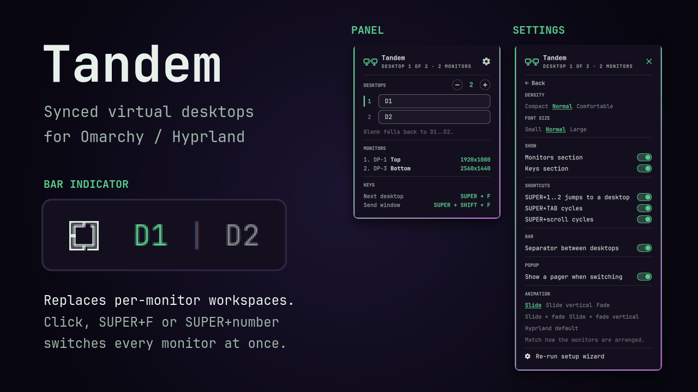
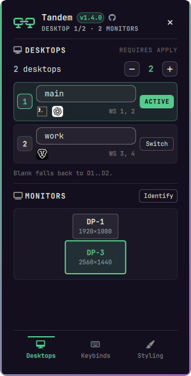
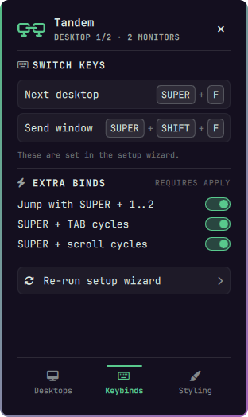
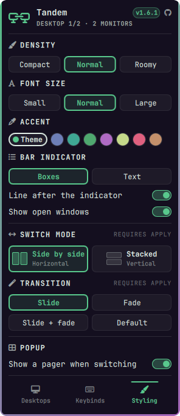

# Tandem

KDE-style virtual desktops for [Omarchy](https://omarchy.org/) / Hyprland.

Every monitor switches workspace **together**, instead of Omarchy's default of
independent per-monitor workspaces. The bar shows `D1 D2` instead of
workspaces `1-5`.



Built with Claude Code.

## Why

I like the way KDE handled this with virtual desktops as opposed to independent workspaces. I typically only have 2 "workspaces" that I swap back and forth between with SUPER + F and I wanted this ability in Omarchy.

https://github.com/user-attachments/assets/117b8858-4796-4549-ae8f-0be6ca892d04

*One keypress; both monitors move together.*

## Model

A desktop owns one workspace per monitor:

```
workspace = (desktop - 1) * #MONITORS + monitor_index
```

Two monitors, two desktops:

| Desktop | Monitor 1 | Monitor 2 |
|---------|-----------|-----------|
| D1      | ws 1      | ws 2      |
| D2      | ws 3      | ws 4      |

A persistent workspace rule pins each workspace to its monitor, so nothing
drifts between screens.

The monitors also stay on the same desktop. If an app switches one monitor
by activating itself — a fullscreen game grabbing focus back the moment its
desktop is hidden, say — tandem undoes it for a moment after its own switch,
and otherwise brings the other monitors along to the same desktop.

## Install

```bash
omarchy plugin add https://github.com/thevideinfra/tandem.git --enable
```

The widget appears in the bar reading **Set up Tandem**. Click it: a terminal
opens with the setup wizard, which asks for monitor order, desktop count,
names, the switch key and the switching animation. Nothing touches Hyprland
until you answer it.

On finishing, the wizard writes your answers, generates the Hyprland config,
adds the settings widget to the right of the bar, and the indicator becomes
`D1 D2`.

Cloning the repo and running `./install.sh` does the same thing
non-interactively, with defaults — 2 desktops, autodetected monitors,
`SUPER+F`, horizontal slide — and is the scripted path.

Re-run the wizard any time:

```bash
~/.config/omarchy/plugins/videinfra.tandem/tandem-setup
```

It asks for monitor order, desktop count, names, the switch key and the
animation, writes them to `shell.json`, and regenerates the Hyprland config.
One key answer gives both binds: `F` becomes `SUPER + F` to switch and
`SUPER + SHIFT + F` to carry a window.

<p>
  
  
  
</p>

The **panel** (two-monitor icon, right of the bar) has three pages, switched
by the tabs along the bottom or with the left and right arrow keys. The header
shows the version and links to this repository. The panel follows your Omarchy
theme: the accent colour marks the current desktop and the chosen options, and
everything else is a tint of the panel's own text colour.

- **Desktops** —
  - `−` / `+` for the desktop count and a name field per desktop.
  - The one you are on is marked `ACTIVE` in the accent colour; the others have
    a **Switch** button.
  - Under each name, the apps with windows open on that desktop as icons (hover
    one for the window's title), and the workspaces the desktop owns, such as
    `WS 1, 2`.
  - **Monitors**: a map of your screens to scale, each with its name and
    resolution and the one with focus outlined. **Identify** shows every
    monitor's name, position and workspace on its own screen for a moment.
- **Keybinds** —
  - The switch and send keys, as key caps. Click a row to change it: toggle the
    modifiers, then press the key. The send key follows the switch key until you
    set it to something else.
  - Switches for `SUPER + 1..n`, `SUPER + TAB` and `SUPER + scroll`, and a
    button that re-runs the setup wizard for the rest.
- **Styling** —
  - **Density** (**Compact**, **Normal** or **Roomy**) and **font size**
    (**Small**, **Normal** or **Large**).
  - **Bar indicator**: **Boxes** (each desktop in a rounded box, the current one
    filled with the accent) or **Text**, and a switch for a thin line after the
    last desktop that sets it apart from the icons beside it.
  - **Switch mode**: whether the monitors sit side by side or stacked, so a
    switch moves the way they are arranged.
  - **Transition**: slide, fade, slide and fade, or Hyprland's own.
  - A **pager popup** switch, off by default: a small card in the middle of
    each screen after a desktop switch. It has one square per desktop, named
    as in the bar, with the current one marked and an arrow towards where you
    went. It follows the switch mode — sideways for side by side, stacked
    for stacked.

Desktop, name, key, switch-mode and transition edits are **staged**. A banner
appears above the tabs with how many are pending, and **Apply & reload** writes
them: each write regenerates and reloads the Hyprland config, too disruptive
to do per click. **Revert** discards them; so does closing the panel. Density,
font size, the bar indicator and the popup only change how things look, so they
save as you click.

## Updating

```bash
omarchy plugin update videinfra.tandem
omarchy restart shell
```

> **Installed before 19 Sep 2026?** The repository history was rewritten on
> that date, so `omarchy plugin update` stops with "cannot fast-forward".
> Your install still works. Move it onto the new history once — this keeps
> your settings and generated config:
>
> ```bash
> git -C ~/.config/omarchy/plugins/videinfra.tandem fetch origin
> git -C ~/.config/omarchy/plugins/videinfra.tandem reset --hard origin/main
> omarchy restart shell
> ```

## Layout

The repo root is the plugin, as `omarchy plugin add` requires.

```
manifest.json     bar-widget plugin, allowMultiple
BarWidget.qml     entry point; picks a role from its bar entry
Indicator.qml     the desktop indicator in the bar (boxes or text)
Settings.qml      the settings panel
TandemIcon.qml    the two-monitor bar icon
DesktopPopup.qml  the pager popup shown after a switch
body.lua          the logic, hand-maintained
tandem-apply      generates tandem.lua from settings, installs the loader
tandem-setup      gum wizard; writes settings, then calls tandem-apply
tandem-config     get / set / set-json; the panel's back end
tandem.lua        GENERATED -- not in git
```

Both widgets are one plugin with two bar entries. A manifest declares a single
`barWidget` entry point, so `BarWidget.qml` loads `Indicator.qml` or
`Settings.qml` depending on `role`:

```json
left:  { "id": "videinfra.tandem", "desktops": 2 }
right: { "id": "videinfra.tandem", "role": "settings" }
```

## Settings

Settings are **flat keys on the plugin's bar entry** in
`~/.config/omarchy/shell.json` — the shape the stock clock uses, because the
bar hands a widget every key on its entry except `id`:

```json
{ "id": "videinfra.tandem",
  "monitors": ["DP-1", "DP-2"],
  "desktops": 2,
  "labels":   ["desktop1", "desktop2"],
  "toggle":   "SUPER + F",
  "send":     "SUPER + SHIFT + F",
  "numbers":  true,
  "tab":      true,
  "scroll":   true,
  "animation": "slide",
  "mode":     "horizontal",
  "density":  "normal",
  "fontSize": "normal",
  "indicator": "boxes",
  "divider":  false,
  "popup": false }
```

- `monitors` — omit to autodetect, ordered top-to-bottom then left-to-right.
- `labels` — desktop names. Omit or use `[]` for the `D1`..`Dn` default; a
  short list names only the desktops it covers.
- `numbers` / `tab` / `scroll` — the optional binds: `SUPER+1`..`n`,
  `SUPER+TAB`, and `SUPER+scroll`. Set one `false` to leave that key to
  Omarchy.
- `animation` — how a switch is drawn: `slide`, `slidevert`, `fade`,
  `slidefade`, `slidefadevert`, or `none` to keep Hyprland's own workspace
  animation. Match the direction the monitors are arranged in — `slide` for
  side by side, `slidevert` for stacked. The panel offers this as a switch
  mode plus a transition and joins them.
- `mode` — `horizontal` (side by side) or `vertical` (stacked). The pager
  popup follows it, and the panel uses it for the transitions that have no
  direction of their own (`fade`, `none`). Omit it and it comes from
  `animation`.
- `toggle` / `send` — the switch key and the carry-a-window key. The wizard
  asks for one key and derives both (`F` gives `SUPER + F` and
  `SUPER + SHIFT + F`); set them here to use unrelated keys.
- `density` / `fontSize` — the panel's own layout: `compact`, `normal` or
  `roomy` (`comfortable` is still read as `roomy`), and `small`, `normal` or
  `large`. They change nothing in Hyprland or the bar.
- `popup` — show the pager popup after a desktop switch. Off by default.
- `indicator` — how the bar shows the desktops: `boxes` (the default) or
  `text`.
- `divider` — draw a thin line after the last desktop in the bar. Off by
  default.

`labels`, `mode`, `density`, `fontSize`, `popup`, `indicator` and `divider` are display settings that
the panel and the bar widget read live from `shell.json`, so changing only
those skips the Hyprland regenerate-and-reload and needs no shell restart.

Edit by hand and re-run `tandem-apply`, or use the panel or wizard.

`tandem-apply` writes `tandem.lua` (config block plus `body.lua`),
syntax-checks it with `luac -p` before replacing the previous file, and
appends one line to `hyprland.lua`:

```lua
pcall(dofile, (os.getenv("HOME") or "") .. "/.config/omarchy/plugins/videinfra.tandem/tandem.lua")
```

## Keys

Defaults; all configurable.

| Key | Action |
|-----|--------|
| `SUPER + F` | Next desktop |
| `SUPER + SHIFT + F` | Send window to next desktop |
| `SUPER + 1`..`n` | Jump to desktop |
| `SUPER + SHIFT + 1`..`n` | Send window to desktop |
| `SUPER + TAB` / `SHIFT + TAB` | Next / previous desktop |
| `SUPER + scroll` | Next / previous desktop |
| `SUPER + drag`, then a keyboard switch | Carry the dragged window one desktop |
| `SUPER + drag`, then `SUPER + scroll` | Carry it across any number of desktops |

Clicking `D1` / `D2` switches desktop. The two-monitor icon opens the settings panel.

`tandem.lua` retires the stock per-monitor workspace bindings, which move one
screen at a time and desync the desktops.

> **Carrying differs by switch type.** `SUPER+scroll` carries a dragged window
> across any number of desktops and drops it on release — Hyprland does that
> itself. A keyboard switch carries it **one desktop per grab**; grab again to
> go further. Nothing reports the mouse button coming up, so the keyboard path
> cannot safely do more. See [NOTES.md](NOTES.md).

## Uninstalling

```bash
cd ~/.config/omarchy/plugins/videinfra.tandem
./uninstall.sh
```

Does everything: restores `omarchy.workspaces` to the slot the indicator
occupied, removes the settings entry, strips the loader line from
`hyprland.lua`, deletes the plugin, and reloads. `omarchy plugin remove` is
not needed — `uninstall.sh` deletes the plugin directory itself.

Run it **before** `omarchy plugin remove`, not after: that command deletes the
plugin directory, and `uninstall.sh` lives inside it.

If the plugin is already gone, or you prefer the Omarchy command:

```bash
omarchy plugin remove videinfra.tandem
sed -i '/videinfra.tandem\/tandem.lua/d; /-- Virtual desktops (videinfra.tandem)/d' ~/.config/hypr/hyprland.lua
hyprctl reload
```

`plugin remove` restores `omarchy.workspaces` on its own, because the manifest
declares `"omarchy": { "clonedFrom": "omarchy.workspaces" }`. It leaves the
loader line behind, which the `sed` removes — harmless either way, since the
line is a `pcall` and does nothing once the file is gone. Tandem also reloads
Hyprland itself on the next desktop switch, so the stock bindings return even
without the `hyprctl reload`.

## Why it needs a setup step

An Omarchy plugin is QML. Manifests accept only Quickshell kinds, so there is
no declarative hook for keybindings or workspace rules, and `omarchy plugin
add` deliberately runs nothing from the plugin it installs.

Plugin QML is not sandboxed, though — `authentication` is the registry's only
gated capability — so Tandem does it imperatively: the widget launches the
wizard, the wizard writes settings, and `tandem-apply` generates the Lua and
adds the loader line. Nothing is written until you answer the wizard.


## Notes

[NOTES.md](NOTES.md) documents the Hyprland Lua API traps this is built
around. Read it before touching drag-carry.
